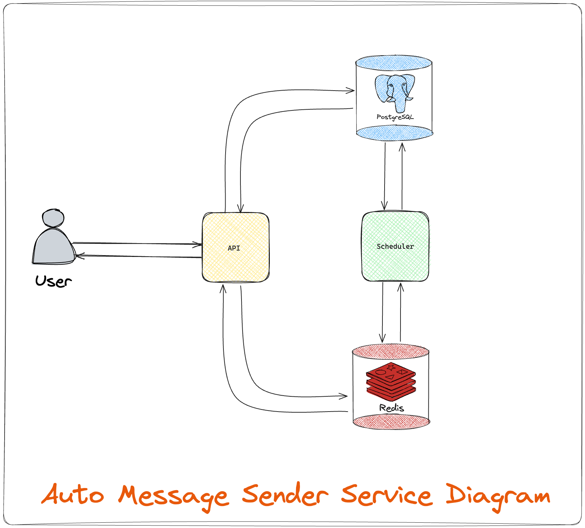

## Auto Message Sender Service

This project is a simple auto message sending service. System that automatically sends 2 messages retrieved from the database, which have not yet been sent, every 2 minutes.


## System Diagram




## Configuration

API and Scheduler services are using environment variables for configuration. Configuration files can be found in the `api` and `scheduler` folders.

Please make sure to set the environment variables in the `.env` file before running the services.

### API Configuration

```bash
STAGE_STATUS="prod"

# Server settings:
SERVER_PORT=8787
SERVER_READ_TIMEOUT=60

# API Key settings:
API_KEY="INS.er7u2oVtHsmlqWICxMnF.pD5k8zLcYh3iR6XaO"
        
# Database settings:
DB_HOST=service-postgres-svc-1
DB_PORT=5432
DB_USER="app_user"
DB_PASSWORD="f9oOlr7x43IZ9HchxwB1JdVjY5a9KejK"
DB_NAME="message_sender_service_db"
DB_SSL_MODE="disable"
DB_MAX_CONNECTIONS=100
DB_MAX_IDLE_CONNECTIONS=10
DB_MAX_LIFETIME_CONNECTIONS=2

# Redis settings:
REDIS_HOST=service-redis-svc-1
REDIS_PORT=6379
REDIS_PASSWORD="VMBuvVq1BfebTLqcb1J8pBJUDaLpWJ4A"
REDIS_DB_NUMBER=0
```
### Scheduler Configuration

We are using a webhook.site for testing purposes. You can change the `WEBHOOK_API_URL` to your own webhook URL.
But please make sure the webhook response is in the correct format shown below.
```json
{
  "message": "Accepted",
  "messageId": "7d3c5c76-d41b-4f3d-95d5-7d3fbef92dc1"
}
```
Also, you can change the `CRON_JOB_SCHEDULE` to your desired schedule.

```bash
# Webhook settings:
WEBHOOK_API_KEY="INS.me1x9uMcyYGlhKKQVPoc.bO3j9aZwRTOcA2Ywo"
WEBHOOK_API_URL="https://webhook.site/6e8b5e31-72b8-4bb7-9281-5ce46c9657ff"

# Database settings:
DB_HOST=service-postgres-svc-1
DB_PORT=5432
DB_USER="app_user"
DB_PASSWORD="f9oOlr7x43IZ9HchxwB1JdVjY5a9KejK"
DB_NAME="message_sender_service_db"
DB_SSL_MODE="disable"
DB_MAX_CONNECTIONS=100
DB_MAX_IDLE_CONNECTIONS=10
DB_MAX_LIFETIME_CONNECTIONS=2

# Redis settings:
REDIS_HOST=service-redis-svc-1
REDIS_PORT=6379
REDIS_PASSWORD="VMBuvVq1BfebTLqcb1J8pBJUDaLpWJ4A"
REDIS_DB_NUMBER=0

CRON_JOB_SCHEDULE="@every 2m"
```

## Usage

First, clone the project:
```bash
git clone https://github.com/tohanilhan/auto-message-sender-service.git
````

Enter the project folder.
```bash
cd auto-message-sender-service;
```
Now, use Makefile to easily build and deploy this service to your local environment.
```bash 
    make [$target]
```

#### Build, Deploy & Run Project

```bash 
    make deploy-all
    or
    make deploy-from-scratch
```

The only difference between **`make deploy-all`** and **`make deploy-from-scratch`** commands is that with make deploy-from-scratch, volumes are deleted before the deployment process begins.


#### Here are the list of all targets that can be used for this project


| **Target** | **Description**                       |
| :-------- | :-------------------------------- |
| `deploy-all:`      | Build and start all containers|
| `deploy-from-scratch:` | Build and start all containers with new volume|
| `remove-all:`      | Remove all containers and images|
| `up-all:`          | Start all containers|
| `down-all:`        | Stop all containers|
| `build-redis:`     | Build redis image|
| `redis-up:`        | Start redis container|
| `redis-down:`      | Stop redis container|
| `redis-logs:`      | Show redis logs|
| `redis-remove:`    | Remove redis container and image|
| `redis-deploy:`    | Build and start redis container with logs|
| `redis-deploy-with-new-volume:` | Build and start redis container with logs and new volume|
| `build-postgres:`  | Build postgres image|
| `postgres-up:`     | Start postgres container|
| `postgres-down:`   | Stop postgres container|
| `postgres-logs:`   | Show postgres logs|
| `postgres-remove:` | Remove postgres container and image|
| `postgres-deploy:` | Build and start postgres container with logs|
| `postgres-deploy-with-new-volume:` | Build and start postgres container with logs and new volume|
| `api-build:`       | Build api image|
| `api-up:`          | Start api container|
| `api-down:`        | Stop api container|
| `api-logs:`        | Show api logs|
| `api-remove:`      | Remove api container and image|
| `api-deploy:`      | Build and start api container with logs|
| `api-deploy-from-scratch:` | Build and start api container with logs and new volume|
| `scheduler-build:` | Build scheduler image|
| `scheduler-up:`    | Start scheduler container|
| `scheduler-down:`  | Stop scheduler container|
| `scheduler-logs:`  | Show scheduler logs|
| `scheduler-remove:`| Remove scheduler container and image|
| `scheduler-deploy:`| Build and start scheduler container with logs|
| `scheduler-deploy-from-scratch:` | Build and start scheduler container with logs and new volume|


## Tech Stack

**Backend:** Go, Fiber

**Database:** PostgreSQL

**Cache:** Redis

**Deployment:** Docker, Docker Compose, Makefile
